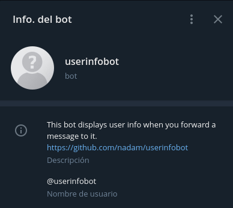
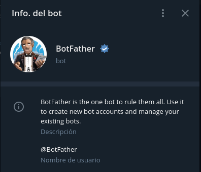

# Japan visa covid bot

Bot to crawl the japanese embassy web page and send an alert when there is an update on the page.

## Configuration

Set up the environment variables:

```bash
TOKEN               # telegram api token
TELEGRAM_USERID     # telegram user id
POSTGRES_PASSWORD   # Database password
POSTGRES_USER       # Database user name
POSTGRES_DB         # Database name
POSTGRES_PORT       # Port to access
POSTGRES_HOST       # Host to access database
EMAIL_SMTP_SERVER   # Address of the email smtp server. Eg smtp.gmail.com
EMAIL_USERNAME      # Username to access the email smtp server
EMAIL_PASSWORD      # Password for the email smtp server
EMAIL_SMTP_PORT     # Port of the smtp server
EMAIL_TO            # Email to send to the embassy
EMAIL_FROM          # Email from
EMAIL_SUBJECT       # Subject of the email
EMAIL_TEST          # true or false to use the EMAIL_FOR_TESTING var
EMAIL_FOR_TESTING   # Email to send if EMAIL_TEST is true
NEWRELIC_APP_NAME   # App name of the newrelic
NEWRELIC_LICENSE    # License key of newrelic
```

If you don't want to use newrelic, you can use the `nometric` type.

## HowTo

Get your telegram user ID using the telegram bot `userinfobot`:



You have to setup the bot in telegram using the bot `BotFather`:



You can use the bot you want, and it will send the notification you want. Just implement the interface inside the file `bots/ibot.go`

Execute the program inside the folder `cmd/japanvisacovidbot/main.go`. Don't forget to start the database using

```bash
bash postgresql.start.sh
```